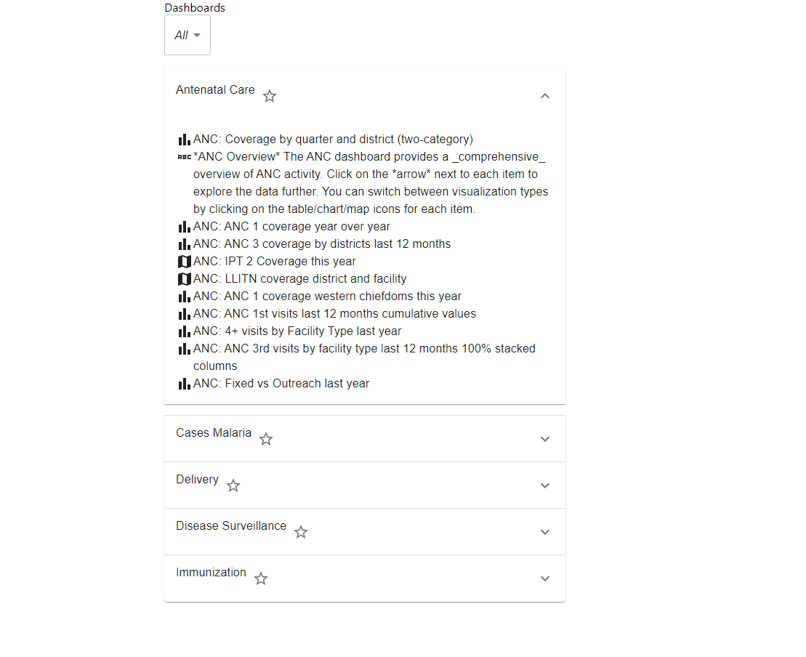

# DHIS2 Technical assessment
## Finished features
- Show the dashboards in a list of collapsible cards
- When a dashboard is expanded, then show all the dashboard items in that dashboard
- Ability to “star” a dashboard and persist the starred states on reload.
- bility to filter dashboard items of a certain type

## Outstanding features:
- Write a test for useDashboards hook. Apologies , I haven't got round to finish it. 
- However, you can find a number of examples that I wrote in different project that shows how to test components that relies on redux
- Gists from my Github https://gist.github.com/Mokhalil
- I didn't have time to fine tune the UI as well.

## App design
- UI Framework : MUI
- State management : Redux